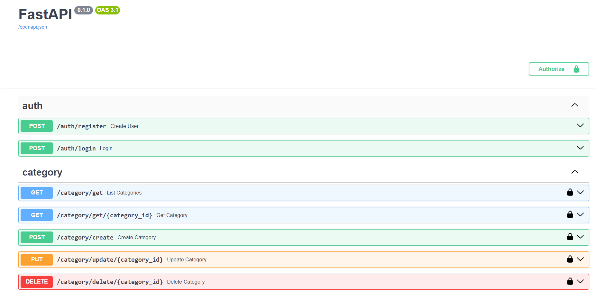
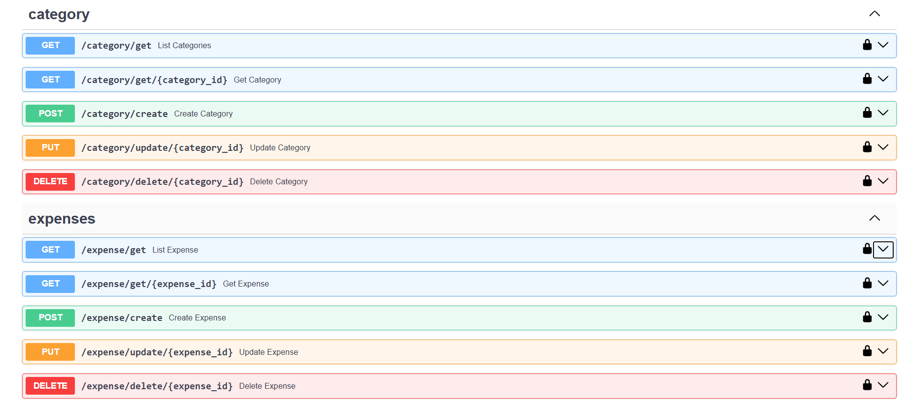

# Expense Tracker API

A REST API for tracking personal expenses, built with FastAPI, SQLAlchemy, PostgreSQL and Alembic. Users sign up, log in with a JWT, and manage their own categories and expenses.



## Features

- JWT authentication with Argon2 password hashing
- Per-user categories and expenses with full CRUD
- Database migrations with Alembic
- Interactive API docs at `/docs`

## Tech stack

Python 3.13 · FastAPI · SQLAlchemy 2 · PostgreSQL · Alembic · Pydantic v2 · python-jose · pwdlib

## Setup

**1. Clone and install**

```bash
git clone https://github.com/priyanshu-cpu/ExpenseTrackerSelf.git
cd ExpenseTrackerSelf
uv sync                            # or: pip install -r requirements.txt
```

**2. Create a PostgreSQL database**

```sql
CREATE DATABASE expense_tracker;
```

**3. Add a `.env` file** in the project root

```env
DB_CONNECTION=postgresql://<user>:<password>@localhost:5432/expense_tracker
SECRET_KEY=<a-long-random-string>
ALGORITHM=HS256
ACCESS_TOKEN_EXPIRE_MINUTES=30
```

**4. Run the server**

```bash
uv run fastapi dev app/main.py
```

Open http://127.0.0.1:8000/docs to explore the API.

## Authentication

Register at `POST /auth/register`, then log in at `POST /auth/login` to get an access token. Send it on every other request:

```
Authorization: Bearer <access_token>
```

In Swagger UI, click **Authorize** and log in; the token is added for you.

## API endpoints



| Method | Endpoint | Description |
|---|---|---|
| POST | `/auth/register` | Create an account |
| POST | `/auth/login` | Get an access token |
| GET | `/category/get` | List categories |
| GET | `/category/get/{id}` | Get a category |
| POST | `/category/create` | Create a category |
| PUT | `/category/update/{id}` | Rename a category |
| DELETE | `/category/delete/{id}` | Delete a category |
| GET | `/expense/get` | List expenses |
| GET | `/expense/get/{id}` | Get an expense |
| POST | `/expense/create` | Create an expense |
| PUT | `/expense/update/{id}` | Update an expense |
| DELETE | `/expense/delete/{id}` | Delete an expense |

All `/category` and `/expense` endpoints require a token.

## Project structure

```
app/
├── main.py        # App entry point
├── database.py    # DB engine and session
├── settings.py    # Loads .env
├── models/        # SQLAlchemy models
├── schemas/       # Pydantic schemas
├── routers/       # auth, category, expense routes
└── utils/         # Security helpers (hashing, JWT)
alembic/           # Migrations
```
